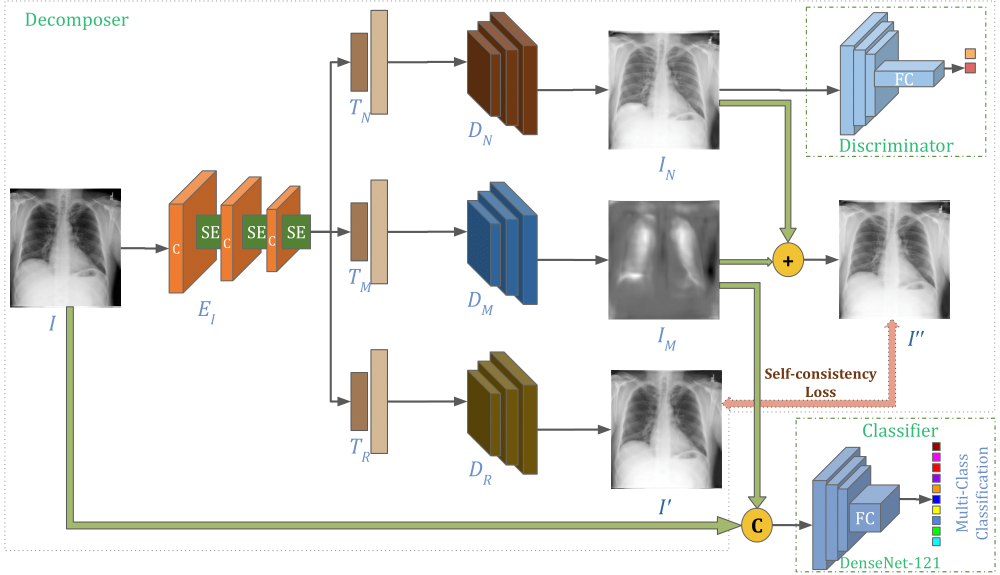

# Generalizable diagnosis of chest radiographs through attention-guided decomposition of images utilizing self-consistency loss

This is the official PyTorch implementation for the LCG method.

[Paper](#) | [Model](#model) | [Data](#data) 
**Generalizable diagnosis of chest radiographs through attention-guided decomposition of images utilizing self-consistency loss** 
by **Jayant Mahawar**, Angshuman Paul 

   
  <em>Fig: A block diagram of the proposed model consisting of a decomposer and a classifier. The decomposer is designed using an attention-guided encoder, a normal image generator, a disease map generator, a re-constructor, and a discriminator.</em>

<be> 

## Highlights
1. We present an attention-guided decomposer that generates a disease map from an input chest x-ray image for the multi-class classification of abnormalities in chest x-rays. The proposed decomposer model is a multi-tasking architecture. It has a single encoder and multiple decoders. While one decoder generates a disease map, the two additional decoders generate a normal synthesized chest x-ray and a reconstructed version of the input image, respectively. <be>
2. We introduce a novel self-consistency loss aimed at preserving consistency in the generation of the synthesized normal chest x-ray, the disease map, and the reconstruction from the decoder.  
3. We propose a novel strategy to train the classifier using disease maps generated from the decomposer alongside the original input images to enhance generalizability. 

## Explanation
The proposed model employs attention-guided decomposition to diagnose chest x-rays. This approach is based on the concept that an abnormal chest x-ray can be viewed as a combination of a normal image with overlaid or substituted abnormal regions. This idea corresponds with the way chest x-ray images are generated, measuring the absorption of x-ray beams within the human body. Typically, darker pixels (indicating air) signify lower x-ray absorption, while brighter pixels (indicating bones) indicate higher absorption. For instance, a healthy lung filled with air appears black on a chest x-ray image. In contrast, when lung opacity is present, where one or both lungs are partially filled with foreign materials like fluid or pus, these areas absorb more x-rays than air. Consequently, the affected lung areas appear brighter (whiter) due to the presence of these materials that absorb more x-rays.

The model consists of two main components: an attention-guided multi-tasking decomposer and a classifier. The decomposer architecture, built upon the generative adversarial network (\cite{8237566}), enables disentangled learning. It separates chest x-ray images with abnormalities into two parts: a normally synthesized chest x-ray and a disease map. The attention mechanism is crucial in highlighting relevant features associated with chest x-ray abnormalities. The classifier then uses the disease map for the final diagnosis.

The model includes one encoder and three decoder architectures for generating disease maps, as illustrated in Figure. The disease map is created by first passing the input image through the encoder $E_{I}$, which generates feature maps. These feature maps are then processed through a transition layer $T_{M}$, providing a latent representation corresponding to the disease map. The decoder $D_M$ then uses this latent representation to produce a disease map corresponding to the input image. Due to the absence of a ground truth disease map for training and comparison, two additional decoders, $D_{N}$ and $D_{R}$, are introduced into the network. The generated disease map can be utilized for various downstream tasks. The model incorporates a classifier that uses the disease map to detect abnormalities in the chest x-ray.

## Requirements: 
1. Python 3.8.  
2. PyTorch 2.0.  

## Release Notes
This repository is a faithful reimplementation of ADSC in PyTorch, including all the training and evaluation codes on NIH Chest X-ray dataset.
